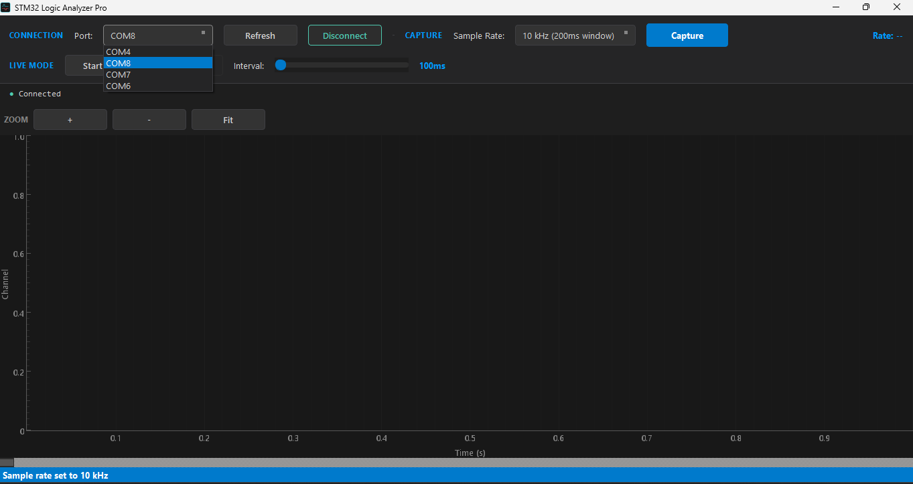
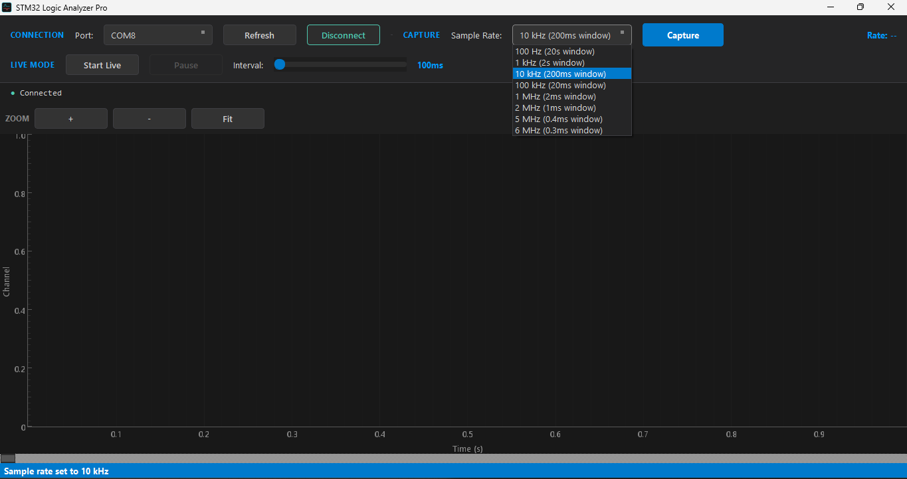
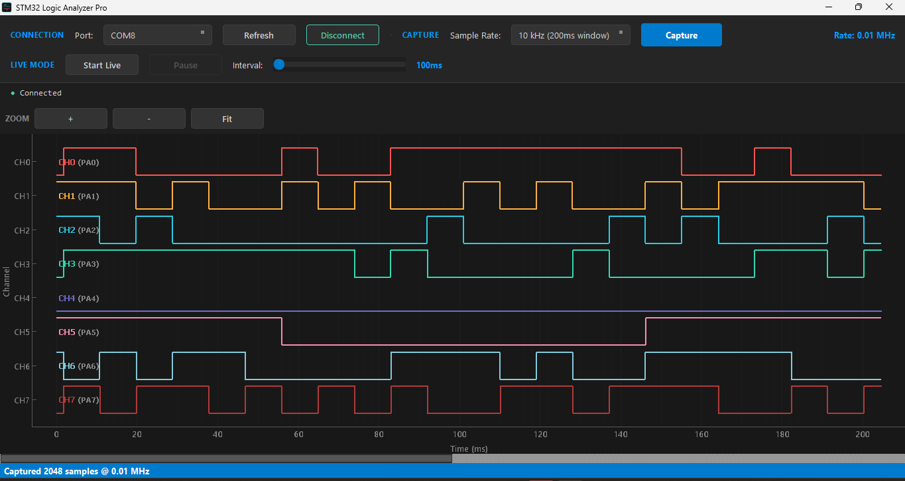
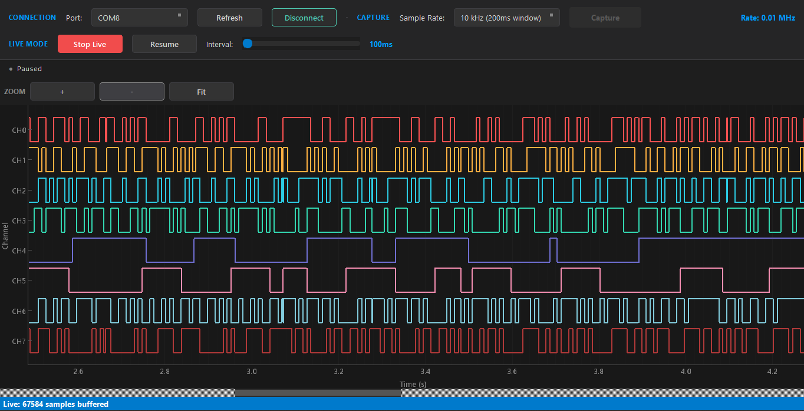

# STM32 Logic Analyzer (LA8) 🚀


**A professional-grade, 8-channel Logic Analyzer for <$5.**

Turn your generic STM32 Blue Pill development board into a powerful digital signal analysis tool. With **6 MHz** theoretical sampling rate, **zero-jitter DMA acquisition**, and a hardware-accelerated **OpenGL** interface, the LA8 bridges the gap between hobbyist toys and expensive benchtop equipment.

---

## ✨ Key Features

*   **⚡ High Performance**: Up to **6 MHz** sample rate (hardware timer driven).
*   **🎯 Zero Jitter**: DMA-based acquisition ensures theoretically perfect timing stability.
*   **🖥️ Fluid UI**: **60 FPS** waveform rendering using hardware-accelerated OpenGL (`pyqtgraph`).
*   **📡 8 Channels**: Parallel capture on pins **PA0 - PA7**.
*   **🔄 Live View**: Continuous "Rolling Buffer" mode with auto-scroll and 5-minute retention history.
*   **🛠️ Professional Tools**:
    *   Horizontal Scrollbar & Zooming.
    *   Pause/Resume analysis.
    *   Dark Mode UI.

---

## 🏗️ Architecture

The system uses a distributed architecture to overcome the bandwidth limitations of standard UART.

1.  **Distributed Processing**:
    *   **Edge (STM32)**: Handles Hard Real-Time signal acquisition into internal SRAM.
    *   **Host (PC)**: Handles Soft Real-Time visualization and massive data buffering.
2.  **Store-and-Forward Protocol**:
    *   The STM32 captures a "burst" of data at high speed (e.g., 6 MB/s).
    *   It buffers this data and transmits it to the PC at UART speeds (11.5 KB/s).
    *   The PC software stitches these bursts together to create a seamless timeline.

👉 **[Read the Engineering Whitepaper](docs/technical_whitepaper.md)** for a deep dive into the DMA engine and design trade-offs.

---
## 📂 File Structure
```text
/
├── firmware/
│   └── stm32_logic_analyzer.ino                        # Arduino Sketch for STM32
|   └── stm32_loc_analyzer.ino.GENERIC_F103C6TX.bin     # Readymade firmware reeady to upload
├── software/
│   ├── gui/                                            # PyQt5 GUI Components
│   ├── capture.py                                      # Data decoding logic
│   ├── device.py                                       # Serial hardware driver
│   └── main.py                                         # Application Entry Point
├── docs/
│   ├── technical_whitepaper.md                         # Engineering Details
│   └── build_instructions_linux.md
└── assets/                                             # Images and Icons
```
---

## 🚀 Getting Started

### 1. Hardware Setup
You need an **STM32F103C8T6** ("Blue Pill") or similar board and a USB-to-TTL Serial adapter.

**Wiring**:
*   **Signal Inputs**: `PA0` to `PA7` (Channel 0 - 7).
*   **UART**:
    *   STM32 `PA9` (TX) -> Serial Adapter `RX`.
    *   STM32 `PA10` (RX) -> Serial Adapter `TX`.
*   **Power**: 3.3V or 5V (Common Ground is critical!).

### 2. Flashing Firmware
**Step 1: Install STM32 Board Support**
1.  Open Arduino IDE Preferences.
2.  Add this URL to "Additional Boards Manager URLs":
    `https://github.com/stm32duino/BoardManagerFiles/raw/main/package_stmicroelectronics_index.json`
3.  Go to **Tools > Board > Boards Manager**, search for "STM32", and install **"STM32 MCU based boards"** by STMicroelectronics.

**Step 2: Board Configuration**
Select **Tools > Board > STM32F1 series > Generic STM32F1 series** and apply these settings:

| Setting | Value |
| :--- | :--- |
| **Board Part Number** | `Generic F103C6Tx` (or `C8Tx` depending on your board) |
| **U(S)ART Support** | **Enabled (no generic 'Serial')** |
| **USB Support** | **None** |
| **Optimize** | Smallest (-Os default) |
| **C Runtime Library** | Newlib Nano (default) |
| **Upload Method** | **STM32CubeProgrammer (Serial)** |

**Step 3: Flash**
1.  Compile `firmware/stm32_logic_analyzer.ino` & export the compiled Binary from the sketch tab or ```ctrl + Alt + S``` (Skip this step if Opting for readymade firmware).
2.  Download & Install STM32CubeProgrammer from ST Microelectronics Website.
3.  set the STM32 "BOOT0" jumper to **1**, press the Reset button then Select UART and Baud Rate to 115200.
4.  Connect your USB-TTL adapter (A9->RX, A10->TX).
5.  Press Reset on the board, then select the preferred Binary from the Proper Location & click **Upload**.
6.  After upload, set "BOOT0" back to **0** and press Reset.

### 3. Running the Software

**Option A: Standalone Executable (Windows)**
*   Download the latest release.
*   Run `STM32_Logic_Analyzer.exe` (Not Ready Yet, If anybody can do it, Please Open a Pull Request).

**Option B: Python Source**
```bash
# Install dependencies
pip install -r software/requirements.txt

# Run
python software/main.py
```

**Linux Users**: Check [Build Instructions](docs/build_instructions_linux.md).

---

## 📸 Screenshots






---

## 🤝 Contributing
Contributions are welcome! Please read the [implementation plan](docs/technical_whitepaper.md) to understand the architectural constraints before optimizing.

## 📄 License
This project is licensed under the MIT License - see the [LICENSE](LICENSE) file for details.


